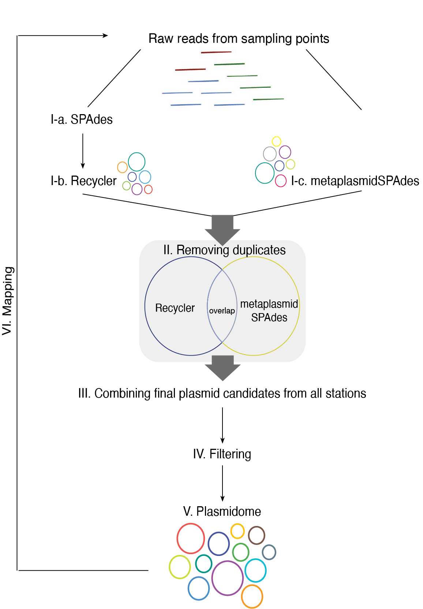

# Plasmidome detection and analysis

## Table of Contents

- [Project Description](#project-description)
- [Installation](#installation)
- [Usage](#usage)
- [Feedback](#contributing)
- [Acknowledgements](#license)

## Project Description

To extend the repertoire of environmental marine plasmids, we established a pipeline for the de novo assembly of plasmids in the marine environment by analyzing available microbiome metagenomic sequencing data. By applying the pipeline to data from the Red Sea, we identified 362 plasmid candidates. We showed that the distribution of plasmids corresponds to environmental conditions, particularly, depth, temperature and physical location. At least seven of the 362 candidates are most probably real plasmids, based on a functional analysis of their open reading frames (ORFs). Only one of the seven has been described previously. Three plasmids were identified in other public marine metagenomic data from different locations all over the world; these plasmids contained different cassettes of functional genes at each location. Analysis of antibiotic- and metal-resistance genes revealed that the same positions that were enriched with genes encoding resistance to antibiotics were also enriched with resistance to metals, suggesting that plasmids contribute site-dependent phenotypic modules to their ecological niches. Finally, half of the ORFs (50.8%) could not be assigned to a function, emphasizing the untapped potential of the unique marine plasmids to provide proteins with multiple novel functions. Paper under review.

## Requirements

- BLAST+ 
- <a href="https://github.com/ablab/spades">SPAdes 3.14+</a>
- bwa, samtools, bowtie2, seqkit, bcftools
- <a href="https://github.com/Shamir-Lab/Recycler">Recycler</a>
- <a href="https://github.com/hyattpd/Prodigal">Prodigal</a>
- <a href="https://github.com/ebi-pf-team/interproscan">interproscan</a>
- <a href="https://github.com/santirdnd/COPLA">COPLA</a> 
- <a href="https://github.com/ablab/plasmidVerify">plasmidVerify</a> 
- <a href="https://github.com/ablab/viralVerify">viralVerify</a> 
- plasmid dataset in FASTA format (in this study the plasmid database <a href="https://ccb-microbe.cs.uni-saarland.de/plsdb">PLSDB</a>)
- File with sampling stations description and data, called stations.txt: 
sample_id, Station number, station location, temperature, depth, any other physical parameters 
- File with samples raw reads links, called samples_matrix.txt: 
station_id (stationNumber_stationDepth), sample_id, forward link, reverse link
- File with databases dbLinks.txt
- ACLAMEproteins.zip upload to DBs folder manually

## Installation

Clone the source code from GitHub:

```
git clone https://github.com/Tal-Lab/Plasmidome && ./Plasmidome/setup.sh
```

Make sure you set correct directories in the <b>.env</b> file to BLAST, Recycler, SPAdes. 

Make sure you have bwa, samtools, bowtie2, seqkit, bcftools in you PATH. 

## Usage
Figure 1. Plasmid detection pipeline. Analysis overview. Metagenomic assembly graph is created for the raw reads of each sampling point by using  SPAdes (33) (I-a) followed by Recycler (17) (I-b), or metaplasmidSPAdes (30) (I-c). The resulting plasmid contigs are compared and duplicates are removed (II). Contigs from all stations are combined (III) and filtered (IV). Predicted plasmids are clustered according to sequence similarity, and one candidate from each cluster is selected as representative in the plasmidome (V). Then, raw reads in each sampling point are mapped to the plasmidome to estimate presence of each plasmid at each station (VI). </img>

1. To perform steps I-III of the Plasmidome detection Pipeline (Fig. 1) run python script **PlasmidomeAssembly.py**.
It should generate among all files **all_vs_all.csv** and **CombinedOutput.fasta** in the resource (/res) folder.

2. To perfrom steps IV – V (Fig. 1) run python script **Pipeline_Filtering.py**. It should generate file **Plasmids_byClusters.csv** in data_calculations folder. Manually go over it. Choose 1 representative of each cluster, where possible. Make a **new_names.csv** file in your working directory with two columns: "old_name" and "new_name". Where old_name is a representative of the cluster, and new_name is a new distinct name for the cluster. In cases, where there’s only one plasmid in the cluster, you may leave the old name. 
Run python script **clusters_to_fasta.py** to generate **filtered_plasmids.fasta** in resource (/res) folder. 

3. To perform step VI of the pipeline (Fig. 1), run **BowtieRunner.csh**. You will have files **plasmids_double.fasta** and **all_cov.csv** in Output folder.

4. Run **blast_plsdb.csh** to compare detected candidates with plasmids in PLSDB. This script will generate file **plsdb.csv** in Output folder. Run **db_statistics.py** to detect known plasmids - the result will be printed out in the console. 

5. To get predicted ORFs first run **prodigal_runner.csh**, which will generate **plasmids_double_proteins.faa** in Output folder. Next run <b>orf_filtering.py</b> to obtain ORFs only single plasmid length. The filtered ORFs will be written into **Filtered_ORFs.fasta** in resource (/res) folder.
6. Find function predictions for the ORFs:

   a) Run <a href="http://eggnog-mapper.embl.de/">eggNOG-mapper</a>, by providing  **Filtered_ORFs.fasta** as input. One of the generated files is called **FilteredORF.emapper.annotations.tsv**. Remove first 4 rows and save it as **eggnog_FilteredORFs.csv** in resource (/res) folder. Follow by running **eggNOG_analyzer.py**. 
   
   b) Run **Run_BlastP.py**. It will generate csv files with blast results from <a href="https://pubmed.ncbi.nlm.nih.gov/19933762/">ACLAME</a>, <a href="https://card.mcmaster.ca/">CARD</a>, <a href="http://bacmet.biomedicine.gu.se/">BacMet</a>, <a href="http://www.mgc.ac.cn/VFs/main.htm">Virulence</a>, <a href="https://www.hsls.pitt.edu/obrc/index.php?page=URL20110321220611">Toxin-Antitoxin</a> databases. 
      
   c) Run **IPS_Runner.csh**.

   d)Run **_plasmidVerify_** and **_viralVerify_** using **filtered_plasmids.fasta** as input file. 

   e) Run **Protein_Definer.py**.

7. Run **class_statistics.py** to obtain general statistics parameters by class.

## Feedback

If you have any feedback, please reach out to us at lucyandrosyuk@gmail.com or leave a comment in Discussions.

Please, include “PLASMIDOME github” in the subject and specify your issue.

## Acknowledgements

This study was supported (in part) by grant no. 3-17700 from the Office of the Chief Scientist, Israel Ministry of Health. L.A. is the recipient of a Hi-Tech, Bio-Tech, and Chemo-tech fellowship of Ben-Gurion University of the Negev.